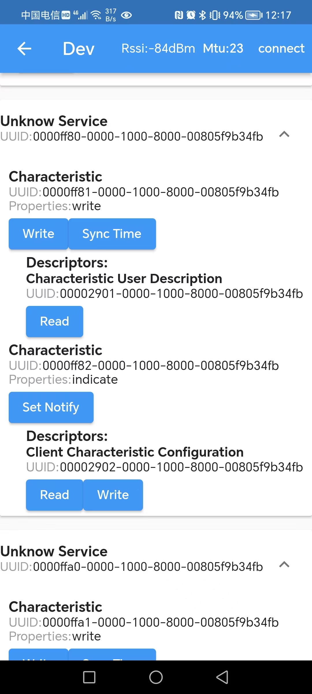

# Time_sync_app
用于蓝牙设备的时间同步APP

## Quickstart
首先，安装仓库目录下的app-release.apk。

安装完毕后，点击首页上方的红色按钮，打开手机蓝牙和GPS，并获取必要的权限(下图中我的手机分别缺少了Blue Permission和GPS Permission)

获取权限完毕后，点击右下方的搜索按钮，获取周边的蓝牙设备。

然后，点击"Connect"连接某一设备，此时会进入进阶功能界面。注意:蓝牙连接有一定的不稳定性，如果连接失败可以尝试再连接。

其中，界面的蓝灰色区域为shell，输出操作信息以及返回的信息。

我们点开"Unknow Service"，并且点击"Sync Time"，可以看到，shell中返回了写数据成功的信息以及数据内容(一个256bit的时间戳数据,可以在`./device_control`中的`generateTimestampData()`函数中修改输出怎样格式的时间戳数据)。

